# OceanOmics classifier comparison scripts

Launch analysis (RStudio): [](https://mybinder.org/v2/gh/PhilippBayer/OceanOmics-classifier-comparison/HEAD?urlpath=rstudio)  

[](https://www.docker.com/) [](https://sylabs.io/docs/)

## Analysis

We compared taxonomic classifiers using 12S, 16S, and CO1 databases and different scenarios of Australian marine vertebrate eDNA to answer which classifier works best in which situation, and which classifier is overconfident when given incomplete reference databases. We hope that these results increase trust in eDNA-based biodiversity studies.

This repository contains all data and code to generate the figures and statistics for the OceanOmics taxonomic classifier comparison study. Simply click on the above `binder` button to launch either a Rstudio or Jupyter notebook session in the browser, with access to all code and data in this GitHub repository. There, the code can interactively be changed and different plots and statistics can be (re-)created. The entire analysis is based on R targets which keeps track of all data objects which ensures full reproducibility.

## Where does the data in this repo come from?

This data is based on parsing the output of several classifiers. The code for that is in the `classifiers/` folder. The final parser is usually called `putAllTogether.py`, but each folder's `README` will tell you details.

The simulated amplicon sequences used for all classifiers are in `data/amplicons/`.

The simulated database sequences used for all classifiers are in `data/databases/`. All the code to generate the family-exclusion databases is in `data/make_exclusion_databases/`.

## How do I add more results?

### New classifier

The targets pipeline pulls in results from `data/*tsv.gz`, tab delimited files.

The results should look like this:

| Type |   Query |    Subject | domain | phylum | class|  order|  family|  genus|  species|  OTU |
| -----|---------|------------|--------|--------|------|-------|--------|-------|---------|------|
| BLAST97 | query1 | subject1 | Eukaryota | Chordata | Actinopteri | Myfamily | Mygenus | Myspecies | ASV_1 | 

Add a new tsv.gz file (see the README inside `data/` too) and targets should pick it up. The name in the `Type` column will be used as the
classifier label in all tables and figures. Make sure that the ASV-names in the OTU column are the same names as the ASVs in `data/amplicons/`.
Missing taxonomic labels are either 'dropped' or 'NA'.

Conversely, to remove a classifier move the `.tsv.gz` file out of /data/ (there's a subfolder named `Not_used`) and rerun `targets::tar_make()`.

### New target databases or queries

This one is a bit trickier. You'd have to rerun all classifiers with your new database or your new query, see the `README` files in the `classifiers/` folders for notes on how I ran every classifier.

I used a little trick to make my classification tasks easier: query files end in `.fa`, subject files end in `.fasta`. 

Then look into `code/functions.R` and `code/100_species_final_checks.Rmd` to add the new databases. Most of the hardcoded values in there are to make the plots look prettier because my Query filenames are so long, but the Subject filenames have to be the same as in the other `tsv.gz` files as I use those file-names to distinguish exclusion databases from 'full' databases.

For reproducibility you'd also have to add the new databases to the `data/databases/` folder. 

## How to run this

1. Clone the repo,
2. restore packages and the environment using `renv::restore()`,
3. run `targets::tar_make()`, 

You should have all results in `results/figures/` and `results/tables/` as targets::tar_make() will rerun the entire analysis and make all figures and tables. All the reports are rendered as html files in `code/` until I figure out how to change that.

## Other projects to check out

 * [nf-core taxprofiler](https://github.com/nf-core/taxprofiler) to run many taxonomic classifiers using existing reference databases
 * [nf-core createtaxdb](https://github.com/nf-core/createtaxdb) database creation of many taxonomic classifiers 

## Dependency graph

(regenerate the following using `cat('```mermaid', targets::tar_mermaid(), '```', sep='\n')`)

```mermaid
graph LR
  style Legend fill:#FFFFFF00,stroke:#000000;
  style Graph fill:#FFFFFF00,stroke:#000000;
  subgraph Legend
    direction LR
    x7420bd9270f8d27d([""Up to date""]):::uptodate --- xbf4603d6c2c2ad6b([""Stem""]):::none
    xbf4603d6c2c2ad6b([""Stem""]):::none --- x70a5fa6bea6f298d[""Pattern""]:::none
    x70a5fa6bea6f298d[""Pattern""]:::none --- xf0bce276fe2b9d3e>""Function""]:::none
  end
  subgraph Graph
    direction LR
    xdfc9ff1b391aa400>"f1"]:::uptodate --> x226a5ee01d1e3334>"prepare_mean_median_f1_table"]:::uptodate
    xdfc9ff1b391aa400>"f1"]:::uptodate --> xcb93849922a59cf2>"make_all_median_f1_tables"]:::uptodate
    x21ec04b3aba1a739>"precision"]:::uptodate --> x226a5ee01d1e3334>"prepare_mean_median_f1_table"]:::uptodate
    x21ec04b3aba1a739>"precision"]:::uptodate --> xcb93849922a59cf2>"make_all_median_f1_tables"]:::uptodate
    x8f227df403c8969f>"accuracy"]:::uptodate --> x226a5ee01d1e3334>"prepare_mean_median_f1_table"]:::uptodate
    x8f227df403c8969f>"accuracy"]:::uptodate --> xcb93849922a59cf2>"make_all_median_f1_tables"]:::uptodate
    x5bd3c0b98612ad82>"f0.5"]:::uptodate --> x226a5ee01d1e3334>"prepare_mean_median_f1_table"]:::uptodate
    x5bd3c0b98612ad82>"f0.5"]:::uptodate --> xcb93849922a59cf2>"make_all_median_f1_tables"]:::uptodate
    x47d805de93d2f724>"recall"]:::uptodate --> x226a5ee01d1e3334>"prepare_mean_median_f1_table"]:::uptodate
    x47d805de93d2f724>"recall"]:::uptodate --> xcb93849922a59cf2>"make_all_median_f1_tables"]:::uptodate
    x226a5ee01d1e3334>"prepare_mean_median_f1_table"]:::uptodate --> xa437480d714ce9cc>"make_median_f1_table"]:::uptodate
    x226a5ee01d1e3334>"prepare_mean_median_f1_table"]:::uptodate --> xe200c5d5f45846d3>"make_overview_f1_table"]:::uptodate
    x226a5ee01d1e3334>"prepare_mean_median_f1_table"]:::uptodate --> xa8d8eda9356629b2>"make_mean_f1_table"]:::uptodate
    x92e63fc22641faa5(["merged_all_results"]):::uptodate --> xf37c16a7303abc16(["final_outcomes_negative_bacteria"]):::uptodate
    xbdd42ceae2a54d2c(["truth_set_data"]):::uptodate --> xf37c16a7303abc16(["final_outcomes_negative_bacteria"]):::uptodate
    x92e63fc22641faa5(["merged_all_results"]):::uptodate --> x4c3c668f02e94ea5(["final_outcomes_100"]):::uptodate
    xbdd42ceae2a54d2c(["truth_set_data"]):::uptodate --> x4c3c668f02e94ea5(["final_outcomes_100"]):::uptodate
    x9024d58abea360f6(["kraken_hits_data"]):::uptodate --> x9f533bb9ed6cc0bf(["thirty_subsampled_kraken_hits_data"]):::uptodate
    x1f8a2aa3facf1873>"subsample_blast_thirty_hits"]:::uptodate --> x9f533bb9ed6cc0bf(["thirty_subsampled_kraken_hits_data"]):::uptodate
    xca66a2548aec4c6b(["error_types_figure"]):::uptodate --> x10a7fb6eb6bfb12a(["saved_errors"]):::uptodate
    x063d54dad6ed438a>"my_save_plot"]:::uptodate --> x10a7fb6eb6bfb12a(["saved_errors"]):::uptodate
    x92e63fc22641faa5(["merged_all_results"]):::uptodate --> xbbad7e56e1d5471e(["final_outcomes_wadjemup"]):::uptodate
    xbdd42ceae2a54d2c(["truth_set_data"]):::uptodate --> xbbad7e56e1d5471e(["final_outcomes_wadjemup"]):::uptodate
    x7477a20106b865a4(["subsambled_blast_hits_data"]):::uptodate --> xc7b5a37005176fd4(["truth_set_investigation"]):::uptodate
    xc4269aa5995e6a3f(["subsambled_kraken_hits_data"]):::uptodate --> xc7b5a37005176fd4(["truth_set_investigation"]):::uptodate
    xcc0ae95627a4c782(["subsampled_nbc_hits_data"]):::uptodate --> xc7b5a37005176fd4(["truth_set_investigation"]):::uptodate
    xf80ecf3117225a62(["thirty_subsambled_blast_hits_data"]):::uptodate --> xc7b5a37005176fd4(["truth_set_investigation"]):::uptodate
    x9f533bb9ed6cc0bf(["thirty_subsampled_kraken_hits_data"]):::uptodate --> xc7b5a37005176fd4(["truth_set_investigation"]):::uptodate
    x25ebbc9fc53b1418(["thirty_subsampled_nbc_hits_data"]):::uptodate --> xc7b5a37005176fd4(["truth_set_investigation"]):::uptodate
    xbdd42ceae2a54d2c(["truth_set_data"]):::uptodate --> xc7b5a37005176fd4(["truth_set_investigation"]):::uptodate
    x70622bc5282148b6(["median_f1_table"]):::uptodate --> xa9d595dde94cca52(["saved_median_f1_table"]):::uptodate
    x7c6dfc5f483b8518>"my_save_table"]:::uptodate --> xa9d595dde94cca52(["saved_median_f1_table"]):::uptodate
    x62f627c2bcc7f4a3>"assess_correctness"]:::uptodate --> x5f73e2549f58db1c(["correctness_table"]):::uptodate
    x92e63fc22641faa5(["merged_all_results"]):::uptodate --> x5f73e2549f58db1c(["correctness_table"]):::uptodate
    xbdd42ceae2a54d2c(["truth_set_data"]):::uptodate --> x5f73e2549f58db1c(["correctness_table"]):::uptodate
    x5f73e2549f58db1c(["correctness_table"]):::uptodate --> x70622bc5282148b6(["median_f1_table"]):::uptodate
    xa437480d714ce9cc>"make_median_f1_table"]:::uptodate --> x70622bc5282148b6(["median_f1_table"]):::uptodate
    x6b25831f1b56a7e8(["big_species_table"]):::uptodate --> x86b8e425760310c5(["saved_big_species_table"]):::uptodate
    x7c6dfc5f483b8518>"my_save_table"]:::uptodate --> x86b8e425760310c5(["saved_big_species_table"]):::uptodate
    xa63f30966279f049["all_results"]:::uptodate --> x92e63fc22641faa5(["merged_all_results"]):::uptodate
    x837f996ab35491da>"get_hits_data"]:::uptodate --> x92e63fc22641faa5(["merged_all_results"]):::uptodate
    x85e99da81e7f8576(["overview_f1_table"]):::uptodate --> x944db3dc975b0ad0(["plotted_overview_f1_table"]):::uptodate
    x935501c128340fcb>"plot_overview_f1_table"]:::uptodate --> x944db3dc975b0ad0(["plotted_overview_f1_table"]):::uptodate
    x5f73e2549f58db1c(["correctness_table"]):::uptodate --> x0fe0b162e5f2d977(["counted_correctness"]):::uptodate
    x057c70bd2d39499f>"count_correctness"]:::uptodate --> x0fe0b162e5f2d977(["counted_correctness"]):::uptodate
    xf2c68c9c4c5bbbc3(["classifier_distances"]):::uptodate --> x4cbe0500373226c1(["classifier_data"]):::uptodate
    x8279777903f3f13d>"get_classifier_data"]:::uptodate --> x4cbe0500373226c1(["classifier_data"]):::uptodate
    x5f73e2549f58db1c(["correctness_table"]):::uptodate --> x85e99da81e7f8576(["overview_f1_table"]):::uptodate
    xe200c5d5f45846d3>"make_overview_f1_table"]:::uptodate --> x85e99da81e7f8576(["overview_f1_table"]):::uptodate
    x2ff9bf2efd8ea8fa(["all_results_files"]):::uptodate --> xa63f30966279f049["all_results"]:::uptodate
    xe9d8f2de59f79fa1(["blast_hits_data"]):::uptodate --> xf80ecf3117225a62(["thirty_subsambled_blast_hits_data"]):::uptodate
    x1f8a2aa3facf1873>"subsample_blast_thirty_hits"]:::uptodate --> xf80ecf3117225a62(["thirty_subsambled_blast_hits_data"]):::uptodate
    x4c833e115353960c(["error_types_table"]):::uptodate --> xca66a2548aec4c6b(["error_types_figure"]):::uptodate
    x5b31c06096fd55a4>"make_error_types_figure"]:::uptodate --> xca66a2548aec4c6b(["error_types_figure"]):::uptodate
    x7c6dfc5f483b8518>"my_save_table"]:::uptodate --> xff3167e163a38079(["saved_overfiew_f1_table"]):::uptodate
    x85e99da81e7f8576(["overview_f1_table"]):::uptodate --> xff3167e163a38079(["saved_overfiew_f1_table"]):::uptodate
    xe9d8f2de59f79fa1(["blast_hits_data"]):::uptodate --> x7477a20106b865a4(["subsambled_blast_hits_data"]):::uptodate
    xa731a5475c946be2>"subsample_blast_hits"]:::uptodate --> x7477a20106b865a4(["subsambled_blast_hits_data"]):::uptodate
    x0fe0b162e5f2d977(["counted_correctness"]):::uptodate --> x378df8f1e0d25e26(["save_correct_table"]):::uptodate
    x7c6dfc5f483b8518>"my_save_table"]:::uptodate --> x378df8f1e0d25e26(["save_correct_table"]):::uptodate
    x9024d58abea360f6(["kraken_hits_data"]):::uptodate --> xc4269aa5995e6a3f(["subsambled_kraken_hits_data"]):::uptodate
    xa731a5475c946be2>"subsample_blast_hits"]:::uptodate --> xc4269aa5995e6a3f(["subsambled_kraken_hits_data"]):::uptodate
    x5f73e2549f58db1c(["correctness_table"]):::uptodate --> x4c833e115353960c(["error_types_table"]):::uptodate
    xb05f917768a3a00b>"make_error_types_table"]:::uptodate --> x4c833e115353960c(["error_types_table"]):::uptodate
    xdd2be6b5e9cf648e(["all_f1_table"]):::uptodate --> x546082feab63db27(["saved_all_f1_table"]):::uptodate
    x7c6dfc5f483b8518>"my_save_table"]:::uptodate --> x546082feab63db27(["saved_all_f1_table"]):::uptodate
    x42612793169637e0(["nbc_hits_data"]):::uptodate --> xcc0ae95627a4c782(["subsampled_nbc_hits_data"]):::uptodate
    x7cb45ddc20e499f4>"subsample_nbc_hits"]:::uptodate --> xcc0ae95627a4c782(["subsampled_nbc_hits_data"]):::uptodate
    xc65a25d9d96e8f7c(["blast_hits"]):::uptodate --> xe9d8f2de59f79fa1(["blast_hits_data"]):::uptodate
    x837f996ab35491da>"get_hits_data"]:::uptodate --> xe9d8f2de59f79fa1(["blast_hits_data"]):::uptodate
    x5f73e2549f58db1c(["correctness_table"]):::uptodate --> xfa1577f5d32df900(["mean_f1_table"]):::uptodate
    xa8d8eda9356629b2>"make_mean_f1_table"]:::uptodate --> xfa1577f5d32df900(["mean_f1_table"]):::uptodate
    x8c50ad78daae7d7d(["correctness_figure"]):::uptodate --> x962124a214cc566f(["save_correct"]):::uptodate
    x063d54dad6ed438a>"my_save_plot"]:::uptodate --> x962124a214cc566f(["save_correct"]):::uptodate
    x0fe0b162e5f2d977(["counted_correctness"]):::uptodate --> x8c50ad78daae7d7d(["correctness_figure"]):::uptodate
    x5071aff9d46fc375>"plot_correctness"]:::uptodate --> x8c50ad78daae7d7d(["correctness_figure"]):::uptodate
    x5f73e2549f58db1c(["correctness_table"]):::uptodate --> xdd2be6b5e9cf648e(["all_f1_table"]):::uptodate
    xcb93849922a59cf2>"make_all_median_f1_tables"]:::uptodate --> xdd2be6b5e9cf648e(["all_f1_table"]):::uptodate
    xfa1577f5d32df900(["mean_f1_table"]):::uptodate --> x9f2fe98d5fbf15c0(["saved_mean_f1_table"]):::uptodate
    x7c6dfc5f483b8518>"my_save_table"]:::uptodate --> x9f2fe98d5fbf15c0(["saved_mean_f1_table"]):::uptodate
    x0fe0b162e5f2d977(["counted_correctness"]):::uptodate --> x74212a93ce53aa32(["correctness_report"]):::uptodate
    x063d54dad6ed438a>"my_save_plot"]:::uptodate --> x3e49986b7c2fca3f(["saved_plot_overview_f1"]):::uptodate
    x944db3dc975b0ad0(["plotted_overview_f1_table"]):::uptodate --> x3e49986b7c2fca3f(["saved_plot_overview_f1"]):::uptodate
    x837f996ab35491da>"get_hits_data"]:::uptodate --> x42612793169637e0(["nbc_hits_data"]):::uptodate
    x5117ea88dbd5add2(["nbc_hits"]):::uptodate --> x42612793169637e0(["nbc_hits_data"]):::uptodate
    x42612793169637e0(["nbc_hits_data"]):::uptodate --> x25ebbc9fc53b1418(["thirty_subsampled_nbc_hits_data"]):::uptodate
    x476c8f557e2b0910>"subsample_nbc_hits_thirty"]:::uptodate --> x25ebbc9fc53b1418(["thirty_subsampled_nbc_hits_data"]):::uptodate
    x5f73e2549f58db1c(["correctness_table"]):::uptodate --> x6b25831f1b56a7e8(["big_species_table"]):::uptodate
    xbb97e5fbae12b8d4>"make_big_table"]:::uptodate --> x6b25831f1b56a7e8(["big_species_table"]):::uptodate
    x4cbe0500373226c1(["classifier_data"]):::uptodate --> x264c7e682ec442b2(["dendrogram"]):::uptodate
    x994946b41121bfa6>"plot_dendrogram"]:::uptodate --> x264c7e682ec442b2(["dendrogram"]):::uptodate
    x544a22aeaed1b2e4>"get_truth_data"]:::uptodate --> xbdd42ceae2a54d2c(["truth_set_data"]):::uptodate
    x70199d3b1152e374(["truth_set"]):::uptodate --> xbdd42ceae2a54d2c(["truth_set_data"]):::uptodate
    x264c7e682ec442b2(["dendrogram"]):::uptodate --> xaf4a1b2829040c15(["saved"]):::uptodate
    x063d54dad6ed438a>"my_save_plot"]:::uptodate --> xaf4a1b2829040c15(["saved"]):::uptodate
    x837f996ab35491da>"get_hits_data"]:::uptodate --> x9024d58abea360f6(["kraken_hits_data"]):::uptodate
    xc4cff7b61e825181(["kraken_hits"]):::uptodate --> x9024d58abea360f6(["kraken_hits_data"]):::uptodate
    x4c833e115353960c(["error_types_table"]):::uptodate --> xcc0a806ae560c099(["saved_error_types"]):::uptodate
    x7c6dfc5f483b8518>"my_save_table"]:::uptodate --> xcc0a806ae560c099(["saved_error_types"]):::uptodate
    x801b32f234e20cdc(["classifier_complexity"]):::uptodate --> x801b32f234e20cdc(["classifier_complexity"]):::uptodate
    xe40955de534d0cf1(["plot_asvs_per_dataset"]):::uptodate --> xe40955de534d0cf1(["plot_asvs_per_dataset"]):::uptodate
    xbf5ac67708da2696(["plot_report"]):::uptodate --> xbf5ac67708da2696(["plot_report"]):::uptodate
    xae01b2c9af307a4d>"get_stats_on_correctness"]:::uptodate --> xae01b2c9af307a4d>"get_stats_on_correctness"]:::uptodate
  end
  classDef uptodate stroke:#000000,color:#ffffff,fill:#354823;
  classDef none stroke:#000000,color:#000000,fill:#94a4ac;
  linkStyle 0 stroke-width:0px;
  linkStyle 1 stroke-width:0px;
  linkStyle 2 stroke-width:0px;
  linkStyle 102 stroke-width:0px;
  linkStyle 103 stroke-width:0px;
  linkStyle 104 stroke-width:0px;
  linkStyle 105 stroke-width:0px;
```

